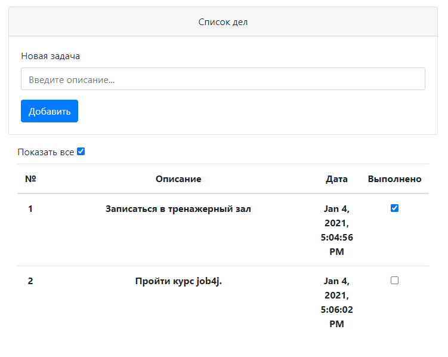
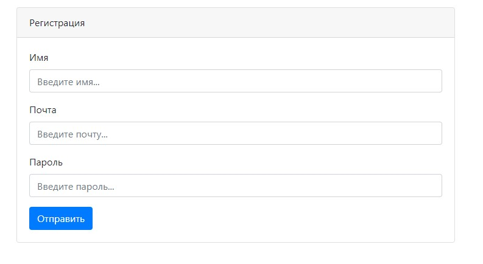
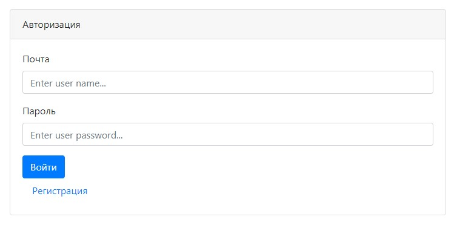

# ToDoList.
## Приложение для контроля списка дел и задач.

##### Использовано в проекте:

- ***Hibernate***
- ***Servlet/JSP***
- ***Maven***
- ***Apache Tomcat***
- ***JUnit/Mockito***
- ***JaCoCo***
- ***Travis CI***

---

## О проекте.
Проект преставляет собой хранилище списка дел и задач, с возможностью отмечать выполненые задачи.

#### В приложение добавлена возможность регистрации и авторизации. 

- Страница регистрации на площадке.

- Страница авторизации на площадке.

---

## Контакты.

***email:*** moroz.future@gmail.com